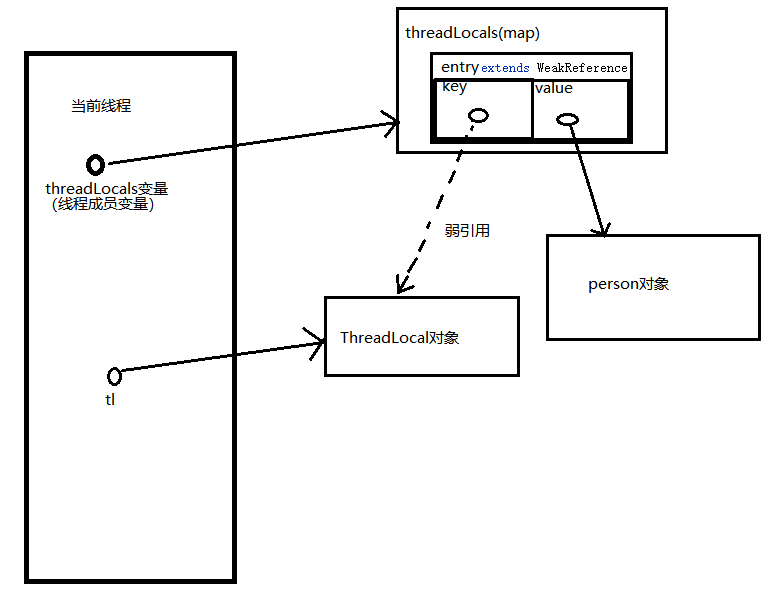

使用threadLocal：

```java
ThreadLocal<Person> tl = new ThreadLocal<>();//将你想放入threadLocal的类当成泛型放进去
threadLocal.set(new Person());
```

我们来看threadLocal.set();的源码：

```java
    public void set(T value) {
        Thread t = Thread.currentThread();//获取当前线程
        ThreadLocalMap map = getMap(t);//将当前线程对象传入方法，返回一个map
        if (map != null)//看有没有这个map，有说明新建过了
            map.set(this, value);//将当前对象（tl）作为key，Person对象作为value存入map
        else
            createMap(t, value);
    }
```

然后我们再看这个ThreadLocalMap的getMap源码

```java

ThreadLocalMap getMap(Thread t) {
    return t.threadLocals;//传入的t是刚才的当前线程对象，说明是从当前线程中取了个ThreadLocalMap的对象，叫threadLocals，并返回他
}
```

然后点击这个threadLocals变量去查看他，发现它是thread类的一个成员变量，说明它是独属于线程的：

```java
ThreadLocal.ThreadLocalMap threadLocals = null;
```

拿到这个线程的成员变量map后，要使用map.set()方法吧当前对象（tl）作为key，Person对象作为value存入map，我们再来看map.set()方法的源码。

```java
private void set(ThreadLocal<?> key, Object value) {

    // We don't use a fast path as with get() because it is at
    // least as common to use set() to create new entries as
    // it is to replace existing ones, in which case, a fast
    // path would fail more often than not.

    Entry[] tab = table;
    int len = tab.length;
    int i = key.threadLocalHashCode & (len-1);

    for (Entry e = tab[i];
         e != null;
         e = tab[i = nextIndex(i, len)]) {
        ThreadLocal<?> k = e.get();

        if (k == key) {
            e.value = value;
            return;
        }

        if (k == null) {
            replaceStaleEntry(key, value, i);
            return;
        }
    }

    tab[i] = new Entry(key, value);//其它行不用关注，关注这行就行了
    int sz = ++size;
    if (!cleanSomeSlots(i, sz) && sz >= threshold)
        rehash();
}
```

其实就是new了个entry，然后把threadlocal对象作为key，person对象作为value传进去了，entry可以理解为键值对，map就是一个个entry组成的。然后我们再看这个entry的源码：

这个entry是个ThreadLocal类的静态内部类，他居然继承了弱引用！

```java
static class Entry extends WeakReference<ThreadLocal<?>> {
    /** The value associated with this ThreadLocal. */
    Object value;
	/**
	*构造函数
    */
    Entry(ThreadLocal<?> k, Object v) {
        super(k);
        /*
        还记得弱引用咋用吗：
         WeakReference<Person> wr = new WeakReference<>(new Person());
         wr.get()//拿到这个person对象
         也就是说，WeakReference的构造函数就是传进去一个Object（Person）对象，然后WeakReference对象和这个Object对象（Person）建立弱引用，再通过wr的各种方法去操作Person对象。
         所以这里调用super（tl对象）；就是相当于new了一个WeakReference对象，然后传进threadLocal对象，然后把这个对象的引用（相当于上面的wr）存进Entry的key中。
        */
        value = v;
    }
}
```


很简单吧，我们来画一下这个图



使用弱引用的好处就是，当我不想用这个tl对象时，我只需要把tl=threadLocal对象的硬引用断掉，gc就会在下次回收回收掉threadLocal对象，避免了这部分内存泄漏；

但是，还有person对象被强threadLocals的entry引用着，无法被回收，只是因为没了key会无法被访问到，还是会产生内存泄漏。虽然threadLocal会在每次执行get或者set时去都会扫描map中有没有key为null的entry，有就删掉，这样从一定程度上避免了内存泄漏，但是，但是，万一你后面的程序再没有执行get或者方法呢，还是有问题，这时候就要显式的调用tl.remove()方法去移除掉这个entry啦。

还有，假如这个线程是你从线程池里拿的，不清理threadLocals用完直接还回去（不知道线程池会帮忙清理吗，待以后学习），下次别的线程拿来用直接就用的你现在的map，那还不完蛋了。

说白了养成好的编程习惯。


