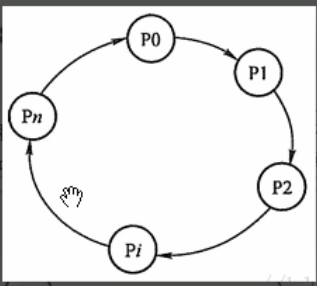

# 死锁

## 1.死锁的四大必要条件（破坏其一即可预防）

1. 互斥条件（不可破坏）

   就是说这个资源只能同时被一个线程持有

2. 不可剥夺条件

   线程所获得的资源在未使用完毕时，不能被夺走，只能主动释放

3. 请求与保持条件

   请求至少已经保持了一个资源，但又提出了新的资源请求，而这个资源被其它线程占有，此时请求进程被阻塞，但是对自己保持的资源并不释放

4. 循环等待条件

   环形等待

   

   

## 2.死锁的处理