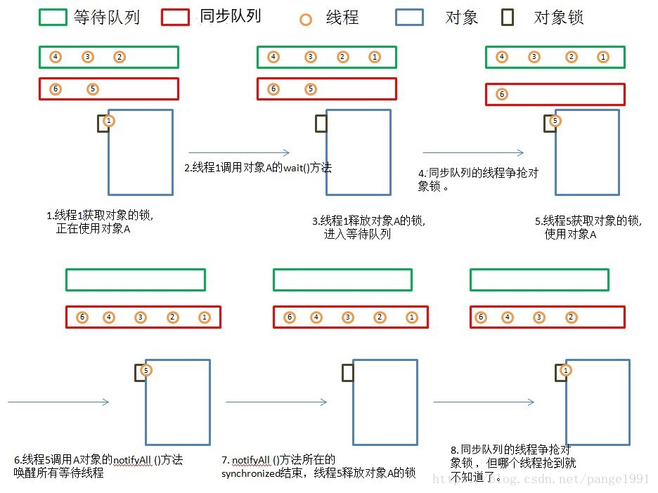

# 线程生命周期

### 1.新建

- new关键字创建了一个线程之后，该线程就处于新建状态
- JVM为线程分配内存，初始化成员变量

### 2.就绪
- 调用start()方法后进入就绪
- JVM为线程创建方法栈和程序计数器，等待线程调度器调度

### 3.运行
- 获得cpu资源，开始运行run()方法

### 4.阻塞
当发生如下情况，线程就会阻塞：
- sleep()主动放弃cpu资源
- 线程调用了一个阻塞式IO方法，在该方法返回之前，该线程被阻塞
- 线程试图获得一个同步锁，但该锁整被其他线程持有。
- 线程正在等待某个通知（notify）
- suspend()方法将线程挂起，易导致死锁

### 5.死亡
- run()或者call()方法执行完成，正常死亡

- 线程抛出一个未捕获的异常

- 调用该线程stop（）方法，易导致死锁

  

  以上都是简图，下面整个详细图：

##### 1.初始状态

​		实现Runnable接口和继承Thread可以得到一个线程类，new一个实例出来，线程就进入了初始状态。

##### 2.1. 就绪状态

​		就绪状态只是说你资格运行，调度程序没有挑选到你，你就永远是就绪状态。
调用线程的start()方法，此线程进入就绪状态。
当前线程sleep()方法结束，其他线程join()结束，等待用户输入完毕，某个线程拿到对象锁，这些线程也将进入就绪状态。
当前线程时间片用完了，调用当前线程的yield()方法，当前线程进入就绪状态。

##### 2.2. 运行中状态

​		线程调度程序从可运行池中选择一个线程作为当前线程时线程所处的状态。这也是线程进入运行状态的唯一一种方式。

##### 3.阻塞状态

阻塞状态是线程阻塞在进入synchronized关键字修饰的方法或代码块(获取锁)时的状态。

##### 4.等待

处于这种状态的线程不会被分配CPU执行时间，它们要等待被显式地唤醒，否则会处于无限期等待的状态。

##### 5.超时等待

处于这种状态的线程不会被分配CPU执行时间，不过无须无限期等待被其他线程显示地唤醒，在达到一定时间后它们会自动唤醒。

##### 6.终止状态

- 当线程的run()方法完成时，或者主线程的main()方法完成时，我们就认为它终止了。这个线程对象也许是活的，但是，它已经不是一个单独执行的线程。线程一旦终止了，就不能复生。

- 在一个终止的线程上调用start()方法，会抛出java.lang.IllegalThreadStateException异常。
  

接下来来个重头戏：

### **等待队列**

- 调用obj的wait(), notify()方法前，必须获得obj锁，也就是必须写在synchronized(obj) 代码段内。
- 与等待队列相关的步骤和图
- 

1. 线程1获取对象A的锁，正在使用对象A。
2. 线程1调用对象A的wait()方法。
3. 线程1释放对象A的锁，并马上进入等待队列。
4. 锁池里面的对象争抢对象A的锁。
5. 线程5获得对象A的锁，进入synchronized块，使用对象A。
6. 线程5调用对象A的notifyAll()方法，唤醒所有线程，所有线程进入同步队列。若线程5调用对象A的notify()方法，则唤醒一个线程，不知道会唤醒谁，被唤醒的那个线程进入同步队列。
7. notifyAll()方法所在synchronized结束，线程5释放对象A的锁。
   同步队列的线程争抢对象锁，但线程1什么时候能抢到就不知道了。 

知识点：

同步队列应该就是指Entry set ，锁池（其中的线程处于阻塞（BLOCKED）状态）

等待队列应该就是指wait set，等待池（其中的线程处于WAITING状态）

**那么这两类集合中的线程都是在什么条件下可以转变为RUNNABLE呢？**

对于Entry Set中的线程，当对象锁被释放的时候，JVM会唤醒处于Entry Set中的某一个线程，这个线程的状态就从BLOCKED转变为RUNNABLE。

对于Wait Set中的线程，当对象的notify()方法被调用时，JVM会唤醒处于Wait Set中的某一个线程，这个线程的状态就从WAITING转变为RUNNABLE；或者当notifyAll()方法被调用时，Wait Set中的全部线程会转变为RUNNABLE状态。所有Wait Set中被唤醒的线程会被转移到Entry Set中。

然后，每当对象的锁被释放后，那些所有处于RUNNABLE状态的线程会共同去竞争获取对象的锁，最终会有一个线程（具体哪一个取决于JVM实现，队列里的第一个？随机的一个？）真正获取到对象的锁，而其他竞争失败的线程继续在Entry Set中等待下一次机会。

